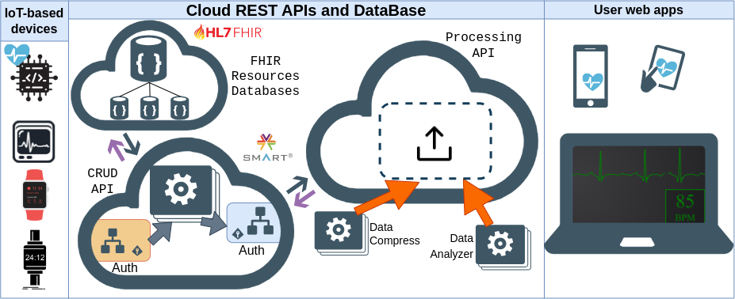

# Projeto IF-Cloud
  


A Figura ilustra a visão  geral do ecossistema de saúde digital para monitoramento contínuo de biossinais com troca de recursos no padrão FHIR. As funcionalidades das APIs em nuvem para suportar projetos IoT e aplicações web de biossinais podem ser resumidas em CRUD e processamento. **IF-Cloud** - *API **\_F\_**HIR para **\_I\_**ntegração de projetos de saúde digital* - compõe o ecossistema como API de processamento.

A Figura ilustra a visão geral de IF-Cloud: API FHIR para integração de projetos de saúde digital **H2Cloud**  – *Heterogeneous Health Cloud* (Nuvem de Saúde Heterogênea) e os variados tipos de aplicações web de saúde previstas na comunicação do ecossistema  de saúde digital. 
A autenticação com [*SMART on FHIR*](https://hl7.org/fhir/smart-app-launch/) eh aplicada de diferentes formas dependendo da natureza da aplicação. Uma vez autenticadas, as aplicações *SMART on FHIR* trocam dados com H2Cloud usando recursos [*FHIR*](https://hl7.org/fhir/). O processamento e o armazenamento dos recursos FHIR habilitam a troca de dados entre as diferentes aplicações.

## Requisitos
- NodeJS [https://nodejs.org/en/](https://nodejs.org/en/)
- Python [https://www.python.org/](https://www.python.org/)
- Aplicação IF-Cloud (este repositório)
- Aplicação FHIR que realiza as operações CRUD

IF-Cloud depende de uma API FHIR com operações CRUD para fornecer os dados a serem processados, pois não tem banco de dados. Diversas implementações de APIs FHIR em nuvem estão disponíveis para realizar as operações CRUD.
Nós recomendamos a [nossa API FHIR especializada em biossinais](https://biosignalinfhir.if4health.com.br/api-docs/) e você encontra o código fonte [neste link](https://github.com/if4health/FASS-ECG). Alternativamente, [HAPI FHIR](https://hapi.fhir.org/baseR4/swagger-ui/) também pode ser utilizada.


## Instalação
1. Faca download deste repositorio
```sh
git clone https://github.com/if4health/ifcloud .
```
2. Configure variáveis de ambiente:

| Rota | Descrição |
|------|-----------|
| `SERVER_PORT` | Porta do servidor |
| `FHIR_API_URL` | URL da API FHIR que realiza as operações CRUD |


3. Instale as dependencias de NodeJS para este projeto 
```sh
cd ifcloud/
npm install
```

4. Instale as dependencias de NodeJS para este projeto 
```sh
cd ifcloud/
npm install
```


## Utilização
Apos o set-up do ambiente escolhido, voce precisa destes comandos para executar
No diretorio `h2cloud` execute:
```sh
npm dev
```
Visualize o servidor rodando no navegador:
```sh
http://localhost:${SERVER_PORT}/
```


## Rotas
| Rota               | Metodo | Descricao                                                                                                  |
|--------------------|--------|------------------------------------------------------------------------------------------------------------|
| `/.well-known/smart-configuration` | GET | Mostra as configurações para autenticação |
| `/auth/register` | GET | Inicia o processo de autenticação |
| `/auth/login` | GET | Exibe a tela de login |
| `/auth/login` | POST | Efetua o login do usuário, sendo paciente ou médico |
| `/auth/authorize` | GET | Exibe a tela das permissões solicitadas pela aplicação |
| `/auth/authorize` | POST | Confirma a autorização da aplicação pelo usuário |
| `/auth/list` | GET | Exibe lista de pacientes do login do médico |
| `/auth/select` | POST | Seleciona o paciente para exibir os dados |
| `/auth/token` | POST | Gera um token com os grant_types: 'authorization_code' e 'client_credentials' |


## Deploy na AWS
#### [Este vídeo](https://www.youtube.com/watch?v=Mb1zueb-s5k) demonstra como fazer Deploy de H2Cloud na AWS.

1. No serviço AWS IAM, na aba Usuários, clique no botão *adicionar um usuário*:
	- **Passo 1**: Escolha um nome de usuário e selecione como *tipo de credencial* a opção *Chave de acesso: acesso programático*.
	- **Passo 2**: Clique no botão *Anexar políticas existentes de forma direta* e selecione a política *AmazonS3FullAccess*.
	- **Passo 3**: Nada a fazer.
	- **Passo 4**: Etapa de revisão de escolhas.
	- **Passo 5**: Você terá criado as chaves para preencher as variáveis de ambiente  `AWS_ACCESS_KEY` e `AWS_SECRET_KEY`.

2. No serviço AWS S3, clique no botão *Criar bucket*. Escolha um nome e uma região AWS e **mantenha bloqueado todo acesso público**. Restante de opções deixe tudo padrão. Agora você tem condições de preencher as variáveis de ambiente `AWS_BUCKET_NAME` e `AWS_BUCKET_REGION`

3. Abra um terminal Unix e gere as chaves públicas e privadas em sua máquina local.
```sh
openssl genrsa -out private.pem 2048
openssl rsa -in ./private.pem -outform PEM -pubout -out public.pem
```

4. No seu recém criado bucket S3, clique em *Carregar* e faça upload dos arquivos private.pem e public.pem. 

5. Neste exemplo, as configurações das demais variáveis de ambiente ficam assim: `SERVER_PORT=8080`, `OAUTH_PUB=public.pem` e `OAUTH_PRIVATE=private.pem`. 

6. Nos arquivos deste repositório, crie um ZIP contendo os diretorios `img`, `Node_src`, `node_modules` e `views` e os arquivos `.env` e `package.json`.

7. No serviço AWS Elastic Beanstalk, clique no botão *Criar aplicativo*. Escolha a Plataforma NodeJS e selecione a opção de *Fazer upload de código*. Envie o seu arquivo ZIP recém criado.

8. Após o deploy de sua aplicação, você terá uma URL para acessar sua aplicação. Essa URL é necessária para a variável de ambiente `DEFAULT_URL`. Clique em *Configurações* e clique no botão *Editar* da caixa *Software*. Em *Propriedades do ambiente*, configure `DEFAULT_URL` com a URL gerada pelo AWS Elastic Beanstalk.

9. Sua aplicação vai reiniciar e estará pronta para o uso. Ufa!!
